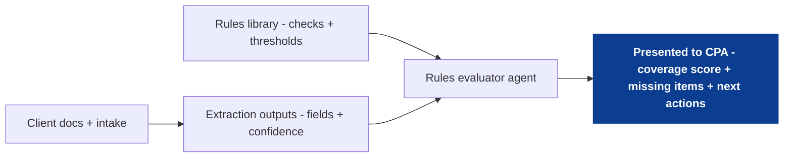
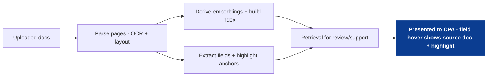

<!--
tags:
  - company:black-ore
  - type:overview
  - domain:tax
  - domain:financial-services
-->

# Case study overview: Black Ore

Black Ore is a fintech/software company building an AI tax-prep platform for CPAs and accounting firms, with a flagship product called **Tax Autopilot**.

In plain English: they're aiming to automate much of the "grunt work" of individual (Form 1040) tax preparation so a preparer can shift from manually keying + reconciling data to reviewing, validating, and advising.

From their public materials, Tax Autopilot is positioned as end-to-end 1040 automation (document ingestion, extraction/classification, drafting, anomaly flagging, and streamlined review). They also describe a broader AI + automation platform for financial services, with tax prep as the initial wedge.

This is a case-study style writeup intended to demonstrate product and systems thinking based on public positioning and reasonable assumptions; not a description of internal implementation.

## Case study directions (draft)
Below are two initial proposals focused on the same north star: **reviewability**. If an AI system can (a) explain what it did, (b) show where it got each value, and (c) quantify what is missing/uncertain, a CPA can review faster without trusting a black box.

### 1) Rules library + coverage scoring (what's missing / how confident are we?)
Create a database of "checks" (rules) that represent what the system should be able to identify for a given return (forms, schedules, fields, thresholds, contradictions). An agent evaluates each rule against the available documents and extracted fields, then produces:
- a coverage score (percent complete by section and overall),
- a list of missing/uncertain items with confidence,
- and a small set of next actions (confirm values, upload missing docs, reconcile mismatches).

[Deep Dive](01_casefile-evaluator-agent.md)

High-level steps:
- Define rules: what evidence is required and when the rule applies.
- Extract: pull candidate fields from documents (with confidence).
- Evaluate: run rules to classify each as satisfied / missing / uncertain.
- Summarize: compute completeness + risk flags for CPA review.
- Prompt: ask the client for confirmations or adjustments.

### 2) Evidence-first document tagging (vectors + text highlighting for traceability)
Tag uploaded documents so each extracted value can be traced back to its source location on the page (including a text highlight anchor). The value is not only better extraction and retrieval; it's review UX: when a CPA hovers over a field, the UI can show the document and highlight exactly where the system pulled the value from.

[Deep Dive](02_evidence-retrieval-layer.md)

High-level steps:
- Ingest: store raw documents and derive page-level representations (OCR/layout).
- Index: derive embeddings and write a vector index + hybrid metadata for filtering.
- Tag: attach extracted fields to document highlights (page + highlight anchor).
- Review: hover/click a field to show the source snippet + highlight region.
- Correct: allow overrides and feed corrections back into extraction.

## Sources
See [sources](sources.md).
