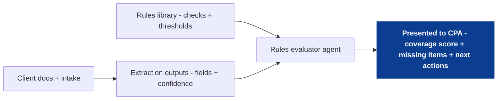

<!--
tags:
  - company:black-ore
  - type:deep-dive
  - domain:tax
  - topic:rules-coverage
  - technique:evaluator-agent
  - technique:clarifying-questions
-->

# Rules library + coverage scoring (what's missing / how confident are we?)

This file is the deep-dive starting point for Black Ore Idea #1. It copies the high-level description, steps, and diagram from `00_overview.md` so we can expand it further without losing alignment.

The proposal: store a library of checks ("rules") in a database, then run an evaluator agent against those rules to produce a coverage score, flag missing/uncertain items, and prompt the client for confirmations or adjustments - so a CPA can review faster without trusting a black box.

See [sources](sources.md) for public references.

High-level steps:
- Define rules: what evidence is required and when the rule applies.
- Extract: pull candidate fields from documents (with confidence).
- Evaluate: run rules to classify each as satisfied / missing / uncertain.
- Summarize: compute completeness + risk flags for CPA review.
- Prompt: ask the client for confirmations or adjustments.



## Scope and assumptions
- This is a case-study draft (public-info only), not a description of Black Ore internals.
- This is not tax/legal advice. Examples are illustrative and avoid prescriptive guidance.
- "Rules" here means an auditable coverage + validation layer, not a full tax law reasoning engine.
- The rules evaluator consumes a "casefile" (return context) including intake answers, documents, and extraction outputs.
- This design pairs naturally with the evidence tagging deep dive: rules should point to evidence highlights where possible.

## The problem to solve (in plain terms)
In tax prep, the bottleneck isn't generating a draft - it's reviewability.

A CPA needs fast answers to:
- What did the system infer and where did it come from?
- What is still missing?
- What is uncertain (low-confidence extraction) or contradictory?
- What should the client confirm or adjust so the return is ready to finalize?

If the platform can't quantify completeness and uncertainty, it creates either false confidence or endless manual re-checking.

## The core idea (in plain terms)
Treat the return as a set of expected checks and evaluate them explicitly.

1) Store checks in a database (each check describes when it applies, what it expects, and what counts as supporting evidence).
2) For each check, compute a tri-state outcome:
   - `satisfied` (supported by evidence),
   - `missing` (required evidence absent),
   - `uncertain` (evidence exists but confidence/conflict is too high).
3) Convert outcomes into two products:
   - a CPA-facing coverage score + prioritized gaps list, and
   - a client-facing set of confirmations/adjustments to resolve the highest-ROI gaps.

## Key artifacts (inputs and outputs)
**Inputs**
- Client intake (structured answers + return context)
- Client documents (W-2s, 1099s, prior-year returns, etc.)
- Extraction outputs (field values + confidence + evidence anchors)
- Rules library (checks + applicability + validation)

**Outputs**
- Coverage score (overall + by section)
- Missing/uncertain items list (prioritized by severity)
- Suggested next actions (client confirmations/adjustments; CPA review flags)
- Optional: per-check "why" bundle (evidence pointers + short explanation)

## Rules library design (database-first)
Storing rules in a database keeps the system:
- auditable (what checks existed for a given filing season?),
- evolvable (add/update a check without rewriting the pipeline), and
- measurable (track which checks are frequently missing/uncertain; which prompts resolve fastest).

### Minimal rule schema (starter)
- Identity
  - `rule_id`, `name`, `description`
  - `version`, `tax_year` (or `effective_start`/`effective_end`)
- Applicability
  - `applies_when` (conditions based on intake + detected artifacts)
  - `gates` (prerequisites; what must be known before evaluation)
- Expectations
  - `expects_documents` (doc types / issuers / year)
  - `expects_fields` (which extracted fields must exist)
- Validation
  - `validate` (cross-checks, tolerances, contradictions)
  - `severity` (how important if missing/uncertain)
- UX templates (optional but useful)
  - `client_prompt_template` (confirmation/adjustment phrasing)
  - `cpa_note_template` (review note phrasing)

### What a "rule" is (types of checks)
You can start with a small taxonomy:
- **Presence checks**: did we see the expected artifact/field?
- **Consistency checks**: do related values reconcile (within tolerance)?
- **Contradiction checks**: do two sources disagree?
- **Reasonableness checks**: does a value look malformed (format/range), prompting review?

Keep it conservative: default to "uncertain" over "confidently satisfied" when evidence is weak.

### Example rules (illustrative, not aligned with true tax policy)
Presence check:
```yaml
rule_id: wages_w2_present
name: W-2 present when wages indicated
applies_when: intake.indicates_wages == true
expects_documents:
  - doc_type: W-2
expects_fields:
  - wages_box1
  - federal_withholding_box2
severity: high
```

Consistency check:
```yaml
rule_id: withholding_non_negative
name: Withholding values are non-negative
applies_when: extracted.federal_withholding_box2 != null
validate:
  - check: extracted.federal_withholding_box2 >= 0
severity: medium
```

Contradiction check:
```yaml
rule_id: taxpayer_ssn_consistent
name: Taxpayer identity consistent across docs
applies_when: extracted.has_identity_fields == true
validate:
  - check: extracted.taxpayer_ssn resolves to one consistent value
severity: high
```

## Evaluator agent responsibilities
The rules evaluator should be boring and consistent.

For each rule, output:
- `status`: satisfied / missing / uncertain
- `confidence`: calibrated confidence in the status
- `evidence`: pointers to supporting highlights/snippets (doc/page/highlight anchor)
- `explanation`: short, reviewable reason ("W-2 found; Box 1 extracted with high confidence")
- `next_action`: CPA flag or client confirmation/adjustment prompt

### Where confidence comes from (practical)
Confidence should combine:
- extraction confidence for required fields,
- evidence quality (clean highlight vs noisy OCR),
- agreement across sources (multiple docs corroborate),
- and check complexity (presence checks > multi-step validations).

## Coverage score (how "percent complete" should work)
Avoid collapsing everything into one "accuracy" number. Separate:
- **completeness coverage**: do we have the expected evidence/fields?
- **validation coverage**: do values pass the checks we can run?

Practical approach:
- Compute coverage by section (identity, income, withholding, deductions, credits, etc.).
- Weight checks by severity so high-severity gaps dominate the score more than nice-to-haves.
- Always surface the top gaps - the score is a summary, not the product.

Example output shape (illustrative):
```text
Coverage (overall): 78%
 - High severity missing: 2
 - Uncertain: 3
 - Ready-to-review: 41 checks

Income: 85% (1 missing, 1 uncertain)
Identity: 92% (0 missing, 1 uncertain)
Withholding: 70% (1 missing, 2 uncertain)
```

## Client confirmations/adjustments (prompting strategy)
The goal is not to ask everything - it's to ask the smallest set of questions that most increases reviewability.

**Heuristics**
- Ask about high-severity gaps first (missing docs / missing key fields).
- Prefer confirmation of extracted values ("We found X - is this correct?") over open-ended questions.
- Keep questions short, one concept per prompt.
- Provide "I don't know" and "skip" to avoid user drop-off.

**Example client prompts (illustrative)**
- "We found one W-2 for 2025. Is this your only W-2 for the year? (Yes/No/Not sure)"
- "We extracted employer name as 'Acme Co'. Please confirm or edit."
- "We could not confidently read the interest amount. Please confirm or adjust the value shown."

## Worked example (illustrative)
**Inputs**
- Uploaded documents: W-2 (one employer), one 1099-type statement, prior-year return
- Intake: indicates wages; indicates some interest/dividend-like income; unsure about additional forms

**Rule outcomes (sample)**
- `wages_w2_present`: satisfied (W-2 found; Box 1 extracted high confidence)
- `taxpayer_ssn_consistent`: uncertain (two documents disagree due to OCR noise; needs confirmation)
- "additional income forms" presence check: missing (intake suggests possible additional forms; none detected)

**CPA view (what this enables)**
- Coverage panel highlights top blockers (identity uncertainty; missing artifact)
- Next actions are concrete:
  - client confirmation: "Confirm SSN shown"
  - client adjustment: "Upload missing document or confirm none exists"

## MVP and expansion
**MVP**
- A small ruleset focused on the highest-volume 1040 checks.
- Tri-state evaluation (`satisfied/missing/uncertain`) with evidence pointers.
- Coverage UI for the CPA + a client confirmation/adjustment task list.
- Basic rule versioning so results can be reproduced later.

**Later**
- More granular check families (per form and per schedule).
- Regression test sets so rule changes don't silently break behavior.
- Feedback loops: when CPAs override, capture the outcome and feed back into extraction/rules tuning.

## How to measure success (draft)
- Time-to-ready: reduction in CPA review time per return (or per section).
- Fewer back-and-forth cycles with clients (confirmations are targeted, not broad).
- Higher first-pass completeness: fewer CPA-found missing items after autopilot draft.
- Lower noise: fewer low-value prompts sent to the client (prompt acceptance rate).

## Risks and mitigations (draft)
- Rules bloat: too many checks overwhelms the CPA. Mitigation: severity weighting + focus on top blockers.
- False confidence: a high score could be misread as "correct". Mitigation: separate completeness vs validation; surface top gaps prominently.
- Maintenance burden: tax rules change. Mitigation: version rules and scope by tax year; prioritize reviewability checks.
- Privacy: client data is sensitive. Mitigation: strict access controls, audit logs, minimize retained prompts/answers.

## Open questions (to refine next)
- What is the right representation for `applies_when` (rules engine, DSL, or agent-assisted gating)?
- How should confidence be calibrated so it matches CPA expectations?
- What is the smallest useful section taxonomy for coverage (so the UI stays legible)?
- Where do CPA overrides feed back into the system (extraction, rules, or both)?
