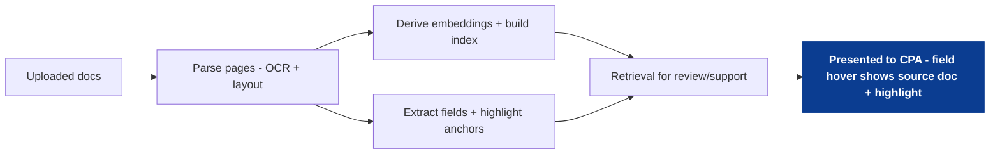
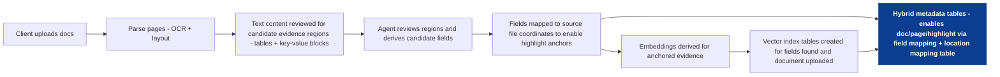
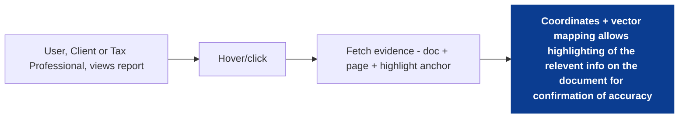

<!--
tags:
  - company:black-ore
  - type:deep-dive
  - domain:tax
  - topic:evidence-retrieval
  - topic:evidence-traceability
  - technique:vector-search
-->

# Evidence-first document tagging (vectors + text highlighting for traceability)

This file is the deep-dive starting point for Black Ore Idea #2. It copies the high-level description, steps, and diagram from `00_overview.md` so we can expand it further without losing alignment.

The proposal: tag uploaded documents so each extracted field can be traced back to a source highlight on the page. When a CPA reviews a populated field, they can hover/click to see the exact highlighted text the automation used - enabling faster review and easier client follow-up.

See [sources](sources.md) for public references.

High-level steps:
- Ingest: store raw documents and derive page-level representations (OCR/layout).
- Index: derive embeddings and write a vector index + hybrid metadata for filtering.
- Tag: attach extracted fields to document highlights (page + highlight anchor).
- Review: hover/click a field to show the source snippet + highlight region.
- Correct: allow overrides and feed corrections back into extraction.

## Scope and assumptions
- This is a case-study draft (public-info only), not a description of Black Ore internals.
- This is not tax/legal advice. The focus is review workflow + traceability, not tax interpretation.
- "Highlight anchor" is an implementation-agnostic pointer to evidence (text spans and/or bounding regions).
- The design assumes a document viewer is part of the workflow (workpapers/fields on one side, source documents on the other).
- Client documents contain sensitive data; access control and audit logging are first-class requirements.

## The problem to solve (in plain terms)
If a system auto-populates a tax return, a CPA's immediate question is:

"Where did this number come from?"

If the answer requires hunting through PDFs, the workflow collapses into manual work again. The platform wins when verification is:
- fast (one hover/click),
- precise (highlights the correct text),
- and auditable (stores what evidence was used).

## The core idea (in plain terms)
For every extracted field, store an evidence mapping that points back to the source document and a highlight anchor on the page.

Then, make evidence retrieval a built-in part of review:
- Hover a field -> show the source document and highlight.
- Click -> show adjacent context (nearby lines/table row) and the extraction confidence.
- Correct -> store the override and use it to improve extraction and downstream checks.

Vector search is a supporting capability: it helps locate relevant evidence quickly in long documents and noisy layouts, and it helps power "find supporting context" when a field is uncertain.

## Key artifacts (inputs and outputs)
**Inputs**
- Uploaded PDFs/images (W-2s, 1099s, statements, receipts, prior returns, etc.)
- OCR/layout outputs (page text, coordinates, table structure signals)
- Field extractor outputs (values + confidence)

**Outputs**
- Vector index tables (region/chunk embeddings)
- Hybrid metadata tables (doc type, issuer, tax year, page number, region type, etc.)
- Field evidence mapping (field -> doc/page/highlight anchor)
- CPA review UX (workpaper fields linked to evidence highlights)

## Data model sketch (minimal)
You do not need a perfect schema to start, but you do need stable identifiers and evidence pointers.

- `raw_documents` (raw capture): storage pointer + metadata + checksum
- `document_pages` (curated): page number, rendered image (optional), OCR text
- `page_regions` (curated): region id + extracted text + coordinates/table signals
- `extracted_fields` (curated): field name, value, confidence, normalization status
- `field_evidence` (curated): `field_id` -> `document_id/page/anchor` (+ provenance)
- `vector_index_tables` (consumption): embeddings keyed by `region_id`
- `hybrid_metadata_tables` (consumption): joinable filters keyed by `region_id`

### Highlight anchor (what gets stored)
Keep it flexible:
- `page_number`
- either `text_span` (char offsets) or `region_id`
- optionally `bbox` or a rendering hint for the viewer

The important part is: it is stable and resolvable during review.

## Index build (ingest and tag)
The goal is to build a retrieval-ready representation over documents so you can both:
- extract values, and
- retrieve supporting context fast during review.

## Review-time UX (hover to audit)
The core UX pattern is "hover to verify":

Optional but powerful additions:
- show extraction confidence alongside the highlight,
- show "nearby context" (table row/section) on click,
- and show a short "why" note (e.g., "Matched W-2 Box 1 label; parsed numeric value").

## Where vector search fits (how it actually helps)
Vector search isn't the UX. It's a capability behind:
- locating likely regions for a field (especially in long statements),
- retrieving supporting context for low-confidence extractions,
- and powering "show me the evidence for this check" in the rules coverage view.

Example usage (illustrative):
- Query embedding: "W-2 Box 1 wages"
- Filter metadata: doc_type=W-2, tax_year=2025
- Retrieve: top regions likely containing the relevant value and its label

## Worked example (illustrative)
**Scenario**
- The autopilot drafts a wage amount from an uploaded W-2.
- The CPA wants to verify quickly.

**What the CPA does**
1) Hover "Wages (Box 1)"
2) The document viewer opens on the W-2 and highlights the exact text used.
3) If the highlight is wrong, the CPA edits the value and marks the highlight as incorrect.

**What the system records**
- The field override (old value -> new value)
- The evidence pointer used (doc/page/highlight anchor)
- A label for training/tuning ("wrong highlight" vs "right highlight, wrong parse")

## MVP and expansion
**MVP**
- Evidence mapping for a small set of high-impact fields and doc types (start narrow).
- Document viewer that highlights the source text for each populated value.
- Manual override path that records corrections and preserves an audit trail.

**Later**
- Table-aware highlights (rows/columns for statements).
- Better retrieval for messy scans (multi-pass OCR, layout heuristics).
- Linking evidence to rule outcomes (coverage view shows evidence per satisfied/uncertain check).

## How to measure success (draft)
- Faster verification: time-to-verify per field during review.
- Higher trust: fewer "hunt through PDFs" moments (proxy: fewer manual doc searches).
- Lower correction cost: reduced time from error detection to fix.
- Highlight quality: percentage of fields with correct evidence highlight on first pass.

## Risks and mitigations (draft)
- OCR/layout errors: highlights can be wrong. Mitigation: store confidence + allow easy override; surface uncertainty.
- Latency: rendering + retrieval must feel instant. Mitigation: caching, prefetching, small evidence bundles.
- Privacy/security: documents are sensitive. Mitigation: strict access controls, encryption, audit logs.
- Complexity: evidence pointers can break if identifiers change. Mitigation: stable IDs + deterministic page/region generation.

## Open questions (to refine next)
- What is the best default highlight anchor (text spans vs region ids) for reliability across renderers?
- How should the UI represent uncertainty (so it helps rather than distracts)?
- How should corrections feed back: retrain extractors, update heuristics, or both?
