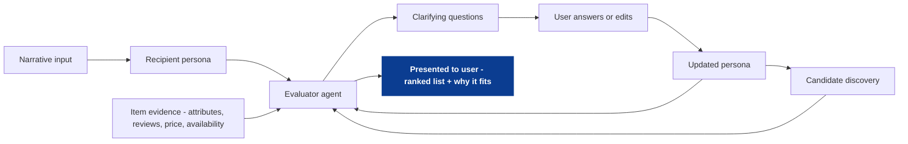
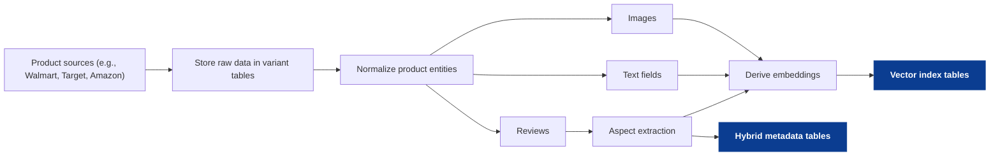
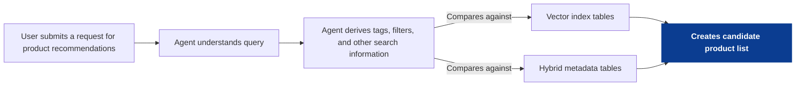
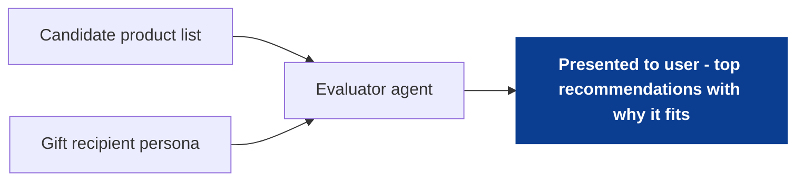
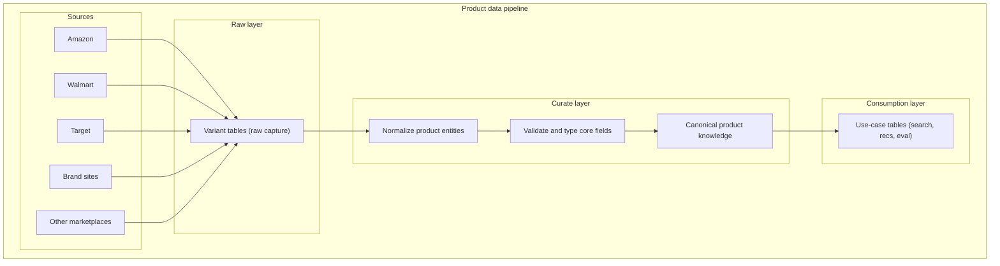

<!--
tags:
  - company:wizard-ai
  - type:overview
  - domain:ecommerce
  - domain:llm-agents
-->

# Case study overview: Wizard AI

Wizard AI presents an “AI shopping agent” experience: the user asks in natural language and expects a curated, trustworthy set of recommendations for gifts or personal purchases. This overview frames three proposals aimed at improving **decision quality** (relevance + trust + speed), then links to deeper documents.

This is a case-study style writeup intended to demonstrate product and systems thinking based on public positioning and reasonable assumptions; not a description of internal implementation.

## The core goal
Wizard’s product loop is essentially: **intent -> candidates -> ranking -> trust -> purchase**. The failure mode is not “no results,” it’s “results that feel generic,” which forces extra turns and reduces trust.

These three ideas target the same goal from complementary angles:
1) [Make intent stable and explicit (personas)](01_persona-evaluator-agent.md)
2) [Improve candidate discovery for real-world queries (multimodal retrieval)](02_multimodal-retrieval.md)
3) [Make reasoning correct and explainable (product knowledge layer)](03_product-knowledge-layer.md)

## The three ideas (high level)

### 1) Persona-guided gift shopping with an Evaluator ("Judge") Agent
Gift shopping is a proxy-preference problem: the shopper is describing someone else, usually via narrative. Convert that narrative into a **Recipient Persona** (constraints + preference signals) and reuse it across the session the way agent systems reuse "role prompts." An evaluator agent evaluates the persona to generate clarifying questions, then scores proposed items-to-buy against the persona and item evidence (attributes, reviews, price, availability, etc.) to produce a ranked list + "why it fits" that is presented to the user.

[Deep Dive](01_persona-evaluator-agent.md)

High-level steps:
- Narrative input: user shares context about the recipient and constraints.
- Recipient persona: system extracts a stable profile (constraints + preferences).
- Evaluator agent (persona pass): identifies missing info and generates clarifying questions.
- User answers/edits: updates the persona quickly (optional but high ROI).
- Candidate discovery: collects potential items from sources.
- Evaluator agent (item pass): scores proposed items against persona + item evidence.
- Presented to user: ranked list + "why it fits" rationales.

### 2) Multimodal retrieval: search by image + context
Many shopping problems are “data match” problems: images, descriptions, attributes, and reviews all carry signal, and any one source can be incomplete. This idea builds vectors on the *product side* (images + text + review aspects) so Wizard can retrieve candidates by similarity across modalities, then refine using constraints and persona signals.

[Deep Dive](02_multimodal-retrieval.md) (stub)

What the diagrams show (three paths):
- Index build: ingest and structure product data, then write vector index tables + hybrid metadata tables.
- Query-time retrieval: agent interprets the request, derives search information, and creates a candidate product list from the indexes.
- Persona-guided evaluation: evaluator uses the gift recipient persona to select a top subset and explain why it fits.

**Index build**
Steps:
- Capture: store raw source records in variant tables (schema can drift without breaking ingestion).
- Normalize: map raw records to consistent product entities and fields.
- Enrich: extract review aspects and other structured signals.
- Embed: derive embeddings from images, text fields, and extracted aspects.
- Persist: write vector index tables and hybrid metadata tables for retrieval.

**Query-time retrieval**
Steps:
- Input: user submits a request for product recommendations (plus any constraints they share).
- Understand: agent interprets intent, constraints, and category/context.
- Derive: agent derives tags, filters, and other search information.
- Compare: search information is compared against vector index tables and hybrid metadata tables.
- Create: outputs a candidate product list for downstream evaluation.

**Combining Persona-guided gift shopping evaluator with vector database**
Steps:
- Inputs: candidate product list + gift recipient persona.
- Evaluate: evaluator agent scores and filters candidates against persona signals and constraints.
- Select: choose a small set of top recommendations (e.g., 5 items).
- Explain: provide short "why it fits" rationales for each recommendation.

### 3) Product knowledge layer + data foundations
Commerce data is messy by default: each source describes products differently, schemas drift over time, and important details can live in unstructured text or reviews. If Wizard can't reliably ingest and retain raw data, it becomes hard to evolve the model, backfill new features, or debug recommendation failures later.

This idea proposes a layered pipeline (raw -> curate -> consumption) anchored by resilient raw capture (variant tables), then progressively normalizes into a canonical product knowledge layer (product/variant/offer/attributes/assets/review-aspects). The outcome is a "LLM-ready" foundation that lets the agent enforce constraints, reduce hallucinations, and generate explanations that are grounded in joinable, consistent product facts.

[Deep Dive](03_product-knowledge-layer.md) (stub)

## Sources
See [sources](sources.md).
