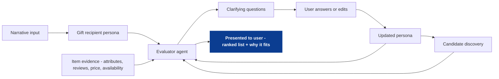

<!--
tags:
  - company:wizard-ai
  - type:deep-dive
  - domain:ecommerce
  - domain:llm-agents
  - topic:personas
  - technique:persona-extraction
  - technique:clarifying-questions
  - technique:evaluator-agent
-->

# Persona-guided gift shopping with an Evaluator ("Judge") Agent

This file is the deep-dive starting point for Idea #1. It copies the high-level description, steps, and diagram from `00_overview.md` so we can expand it further without losing alignment.

Gift shopping is a proxy-preference problem: the shopper is describing someone else, usually via narrative. Convert that narrative into a **gift recipient persona** (constraints + preference signals) and reuse it across the session the way agent systems reuse "role prompts." An evaluator agent evaluates the persona to generate clarifying questions, then scores proposed items-to-buy against the persona and item evidence (attributes, reviews, price, availability, etc.) to produce a ranked list + "why it fits" that is presented to the user.

See [sources](sources.md) for public references.

High-level steps:
- Narrative input: user shares context about the recipient and constraints.
- Gift recipient persona: system extracts a stable profile (constraints + preferences).
- Evaluator agent (persona pass): identifies missing info and generates clarifying questions.
- User answers/edits: updates the persona quickly (optional but high ROI).
- Candidate discovery: collects potential items from sources.
- Evaluator agent (item pass): scores proposed items against persona + item evidence.
- Presented to user: ranked list + "why it fits" rationales.



## Scope and assumptions
- This is a case-study draft (public-info only), not a description of Wizard internals.
- "Gift recipient persona" and "recipient persona" refer to the same concept: a stable profile of who the gift is for.
- Candidate discovery can be powered by any retrieval approach (keyword, hybrid, multimodal); this doc focuses on persona + evaluation.

## The core idea (in plain terms)
Gift shopping is hard because the user is describing someone else's preferences, usually in narrative form. The proposal is to:
1) turn that narrative into a structured **gift recipient persona**, and
2) run an **evaluator (judge) agent** that uses the persona + item evidence to select and justify a short list of recommendations.

The key product benefit is not only better ranking, but better trust: the system can show *why* each item fits and *what assumptions* it made.

## Persona as a persistent "role" layer (analogy)
Modern agent systems often start with an explicit role instruction (e.g., "You are a senior software engineer..."). This idea treats the gift recipient persona the same way: a persistent, explicit instruction layer that steers evaluation consistently across the session.

**Standard role example**
```text
You are a Senior Software Engineer. You write production-quality code, prioritize correctness and readability,
consider edge cases, and ask clarifying questions when requirements are ambiguous.
```

**Gift recipient persona role example**
```text
You are evaluating gifts for: Sarah (user's sister).
Budget: $50-$120. Must arrive by next Friday.
Prefers: minimalist design, high-quality materials, practical items used weekly.
Avoid: strong scents, novelty/gag gifts, overly-branded items.
Past wins: simple jewelry, well-made home goods. Past misses: scented candles.
Prioritize thoughtful + refined without flashy. Explain why each recommendation fits and avoids dealbreakers.
```

## Key artifacts (inputs and outputs)
**Inputs**
- Narrative input (user story + constraints)
- Gift recipient persona (structured + free-form notes)
- Item evidence bundle (attributes, reviews/aspects, price, shipping/availability, merchant signals)
- Candidate product list (from retrieval)

**Outputs**
- Clarifying questions (small set, high ROI)
- Ranked recommendations (top subset, e.g., 5 items) with short "why it fits" rationales
- Optional: near-misses (items rejected + reason) to build trust

## Persona representation (starter schema)
Keep it strict where strictness helps retrieval/evaluation, but preserve nuance in notes.

**Structured fields (high-signal, consistent)**
- Relationship, occasion
- Budget range, delivery deadline
- Hard constraints (size, allergens, materials to avoid, etc.)
- Preferences (categories, brands, style adjectives)
- Dealbreakers ("no fragrance", "no novelty", etc.)
- Confidence flags per field (`confirmed`, `inferred`, `unknown`)
- Evidence pointers back to the narrative (so the user can see and edit what drove each field)

**Free-form fields (nuance)**
- Narrative notes (summarized in user's language)
- Past wins / past misses with reasons
- Open questions the user skipped

## Clarifying questions (persona pass)
The evaluator does an early pass over the extracted persona to generate clarifying questions. The goal is not to ask everything; it's to ask the smallest set of questions that most improves the final recommendation quality.

**Heuristics**
- Ask about hard constraints first (shipping deadline, materials/allergies, sizing).
- Then ask the most discriminative preference (style, category, brand aversion).
- Prefer multiple-choice or short answers; always allow "skip" and "not sure."
- Cap at 3-5 questions per session.

**UX note**
Treat the persona as editable state: the system can propose structured fields, but the user should be able to correct or override them quickly (and the evaluator should respect the edited values).

## Evaluator scoring (item pass)
The evaluator compares each proposed item against:
- the gift recipient persona, and
- the item evidence bundle (not guesswork).

**Scoring rubric (draft)**
- Hard constraints: fail or heavy penalty if violated (budget, deadline, dealbreakers).
- Soft alignment: weighted scoring on style/category fit, practicality, and past wins.
- Unknowns: penalize missing critical attributes rather than hallucinating.
- Diversity: avoid near-duplicates; cap brand/category repetition; ensure variety.

**Output format (draft)**
For each recommended item:
- Match summary (1 line)
- Why it fits (2-4 bullets)
- Risk/unknown (0-1 bullet) when evidence is incomplete

## Worked example (illustrative)
### Narrative input
> "I'm shopping for my sister. She loves minimalist design and hates clutter. She's picky about materials and quality. She hated the scented candle I got her last year. Budget around $100, and it needs to arrive by next Friday."

### Persona extraction (draft)
- Budget: $80-$120 (confirmed)
- Delivery deadline: next Friday (confirmed)
- Preferences: minimalist, practical, high-quality materials (confirmed)
- Dealbreakers: strong scents; novelty gifts; clutter (inferred from narrative)
- Notes: prefers thoughtful + refined; avoids flashy branding

### Clarifying questions (3)
1) "Any materials she avoids (e.g., nickel, wool, leather)?"
2) "Would she prefer a wearable, home good, or experience?"
3) "Any brands she loves or refuses?"

### Candidate product list (examples)
- Stainless steel pour-over kettle ($95, 2-day shipping, no scent, minimalist)
- High-quality wool scarf ($110, 5-day shipping, material unknown sensitivity)
- Minimalist desk organizer ($40, 3-day shipping, risk: clutter if too large)
- Unscented hand soap set ($45, 2-day shipping, risk: still "scent-adjacent")
- Simple sterling silver earrings ($85, 4-day shipping, risk: metal sensitivity unknown)
- Premium notebook + pen set ($60, 2-day shipping, minimalist)

### Evaluator output (top 5)
1) Stainless steel pour-over kettle
   - Why it fits: practical weekly use; minimalist aesthetic; quality material signal; no fragrance risk.
2) Premium notebook + pen set
   - Why it fits: practical; low-clutter; refined without flashy branding; easy to deliver on time.
3) Simple sterling silver earrings
   - Why it fits: aligns with "simple jewelry" past wins; minimalist; fits budget and deadline.
   - Risk/unknown: metal sensitivity not confirmed.
4) Unscented hand soap set
   - Why it fits: practical; avoids strong scents; low clutter.
   - Risk/unknown: confirm truly fragrance-free (avoid "lightly scented").
5) Minimalist desk organizer (small)
   - Why it fits: practical; minimalist; can reduce clutter if sized appropriately.
   - Risk/unknown: verify dimensions to avoid adding clutter.

Near-miss:
- High-quality wool scarf: strong candidate on quality, but material sensitivity is unknown and delivery timing is tighter.

## MVP and expansion
**MVP**
- Narrative intake -> persona extraction -> 3-5 clarifying questions
- User can edit persona fields directly
- Evaluator scoring + rationales; constraint checks with "unknown" handling

**Later**
- Persona templates (common gift archetypes)
- Cross-session persona persistence (explicit opt-in)
- Cohort insights (only if privacy-safe and opt-in)

## How to measure success (draft)
- Product: fewer follow-up turns to reach a shortlist; higher save/shortlist rate; higher purchase completion; higher "confidence" rating.
- Quality: lower constraint-violation rate; higher preference-match ratings; lower restart-search frequency.

## Risks and mitigations (draft)
- Privacy: keep sensitive fields optional; store minimally; offer easy delete; be explicit about what persists.
- Hallucination: require evidence for claims; penalize unknowns; surface uncertainty.
- Overfitting: enforce diversity; avoid repeating brands/categories too aggressively.

## Open questions (draft)
- What is the smallest persona schema that delivers most lift?
- What should persist across sessions vs be session-only?
- Where should evaluator scoring happen (rerank only vs deeper retrieval constraints)?
- Which metrics correlate best with business outcomes for Wizard?
