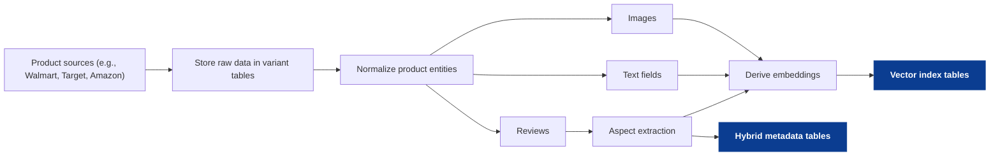

<!--
tags:
  - company:wizard-ai
  - type:deep-dive
  - domain:ecommerce
  - domain:llm-agents
  - topic:multimodal-retrieval
  - technique:vector-search
-->

# Multimodal retrieval: search by image + context

Many shopping problems are "data match" problems: images, descriptions, attributes, and reviews all carry signal, and any one source can be incomplete. This idea builds vectors on the *product side* (images + text + review aspects) so Wizard can retrieve candidates by similarity across modalities, then refine using constraints and persona signals.

See [sources](sources.md) for public references.

## Scope and assumptions
- This is a case-study draft (public-info only), not a description of Wizard internals.
- "Multimodal retrieval" here means: build embeddings on the product side across multiple modalities and retrieve candidates by similarity (not only keyword match).
- This design complements Idea #1: personas provide strong filters/rerank signals once candidates are retrieved.

## The core idea (in plain terms)
When people shop, they often provide *imperfect* starting information:
- an inspiration image ("like this"),
- a short description ("minimalist running shoes"),
- constraints ("under $120, arrives by Friday"),
- and sometimes only noisy web data is available (inconsistent attributes, messy reviews).

The proposal is to represent products in a way that makes similarity search robust:
1) ingest product data from multiple sources,
2) derive embeddings from images + text (+ review aspects),
3) index them for retrieval, and
4) query them with embeddings and structured filters derived from the user's request.

## Key artifacts (inputs and outputs)
**Inputs**
- Product sources (multiple marketplaces / brand sites)
- Raw product records (schema varies by source)
- User request for product recommendations (plus constraints, and optionally a reference image)
- Optional: persona signals (from the gift recipient persona)

**Outputs**
- Vector index tables (embeddings for retrieval)
- Hybrid metadata tables (structured fields for filtering and joinable evidence)
- Candidate product list (for evaluation / reranking / explanation)

What the diagrams show (three paths):
- Index build: ingest and structure product data, then write vector index tables + hybrid metadata tables.
- Query-time retrieval: agent interprets the request, derives search information, and creates a candidate product list from the indexes.
- Persona-guided evaluation: evaluator uses the gift recipient persona to select a top subset and explain why it fits.

**Index build**
Steps:
- Capture: store raw source records in variant tables (schema can drift without breaking ingestion).
- Normalize: map raw records to consistent product entities and fields.
- Enrich: extract review aspects and other structured signals.
- Embed: derive embeddings from images, text fields, and extracted aspects.
- Persist: write vector index tables and hybrid metadata tables for retrieval.

**Query-time retrieval**
Steps:
- Input: user submits a request for product recommendations (plus any constraints they share).
- Understand: agent interprets intent, constraints, and category/context.
- Derive: agent derives tags, filters, and other search information.
- Compare: search information is compared against vector index tables and hybrid metadata tables.
- Create: outputs a candidate product list for downstream evaluation.

**Combining Persona-guided gift shopping evaluator with vector database**
Steps:
- Inputs: candidate product list + gift recipient persona.
- Evaluate: evaluator agent scores and filters candidates against persona signals and constraints.
- Select: choose a small set of top recommendations (e.g., 5 items).
- Explain: provide short "why it fits" rationales for each recommendation.

## Data model sketch (minimal)
You don't need a perfect schema to start, but you do need joinable identifiers and a separation between raw capture and curated fields.

- `raw_products` (variant tables): source payload + metadata (source, URL, crawl time)
- `products` (curated): canonical product ID, title, brand, category
- `product_assets` (curated): images/videos per product
- `product_attributes` (curated): typed attributes (material, dimensions, color, etc.)
- `product_reviews` (raw/curated): reviews + rating signals
- `review_aspects` (curated): extracted aspects (durability, sizing, comfort, etc.)
- `vector_index_tables` (consumption): embeddings keyed by canonical product ID (and optionally per-asset/per-text chunk)
- `hybrid_metadata_tables` (consumption): retrieval filters + evidence pointers (price ranges, availability, shipping SLA, etc.)

## Embeddings and indexing (what actually gets vectorized)
**Product-side embeddings**
- Images: product hero images + variant images (category-dependent)
- Text: title + description + attributes (concatenated or chunked)
- Reviews: optional; usually better as aspect summaries than raw full text

**Indexing approach (practical defaults)**
- Start with a single vector index keyed by canonical product ID with multi-embedding fields (image + text) if your stack supports it.
- If not, maintain separate indexes (image index, text index) and fuse results in reranking.

## Query understanding (derive search information)
From the user request, the agent derives:
- structured filters (category, price, brand constraints, delivery deadline),
- tags (style adjectives like "minimalist", "outdoorsy"),
- query embeddings (text embedding; image embedding if a reference image is available).

## Retrieval + rerank (where quality is won)
**Candidate retrieval**
- Use vector similarity to find "vibe" matches.
- Apply metadata filters to enforce constraints (budget, delivery).

**Rerank**
- Incorporate persona signals (e.g., "no logos", "Nike only", "practical weekly use") as rerank features.
- Apply diversity constraints so results aren't 10 near-duplicates.

## Worked example (illustrative)
### User request
> "I want running shoes like this photo. Under $120, black or neutral, and no big logos."

### Derived search information
- Filters: category=running shoes, price<=120, color in {black, neutral}
- Tags: minimalist, low-branding
- Query embeddings: image embedding (from photo) + text embedding (from request)

### Retrieval outcome
- Candidate product list: mix of visually similar shoes; filtered by price and color.
- Rerank: boosts low-logo matches and de-boosts heavily branded results; ensures variety across brands/models.

## How to measure success (draft)
- Retrieval quality: human relevance judgments, "looks like this" satisfaction, success rate per query type (image-only vs text-only vs hybrid).
- Product outcomes: fewer refinements/turns, higher shortlist/save rate, improved purchase completion.
- Safety/quality: lower constraint-violation rate (e.g., price/deadline), lower "brand/logo" violations.

## Risks and mitigations (draft)
- Cost/latency: embeddings + rerank can be expensive; control candidate set sizes and cache popular queries.
- Data drift: sources change schemas; keep raw capture and reprocess as models/schema evolve.
- Overfitting to vectors: always keep structured filters as first-class constraints.
