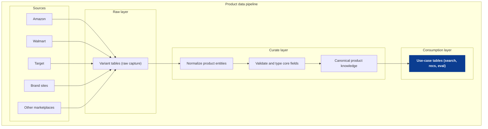

<!--
tags:
  - company:wizard-ai
  - type:deep-dive
  - domain:ecommerce
  - topic:product-knowledge
  - architecture:raw-curate-consumption
  - technique:variant-tables
-->

# Product knowledge layer + data foundations

Commerce data is messy by default: each source describes products differently, schemas drift over time, and important details can live in unstructured text or reviews. If Wizard cannot reliably ingest and retain raw data, it becomes hard to evolve the model, backfill new features, or debug recommendation failures later.

This idea proposes a layered pipeline (raw -> curate -> consumption) anchored by resilient raw capture (variant tables), then progressively normalizes into a canonical product knowledge layer (product/variant/offer/attributes/assets/review-aspects). The outcome is an "LLM-ready" foundation that lets the agent enforce constraints, reduce hallucinations, and generate explanations that are grounded in joinable, consistent product facts.

See [sources](sources.md) for public references.

## Scope and assumptions
- This is a case-study draft (public-info only), not a description of Wizard internals.
- This is technology-agnostic; "variant tables" means "a raw table design that preserves the full source payload (JSON) plus metadata" (Snowflake `VARIANT`, BigQuery `JSON`, Postgres `jsonb`, etc.).
- This doc focuses on product knowledge + data foundations; retrieval/agent logic lives in the other deep dives.

## The core idea (in plain terms)
If an agent is going to recommend products with confidence, it needs a stable way to answer:
- What do we know about this product?
- Where did that fact come from?
- Is the fact current?
- Are we missing something and should we say "unknown" instead of guessing?

The proposal is to keep a resilient raw record of everything you ingest, then progressively curate it into a canonical product knowledge layer that the agent can query and cite.

## Key artifacts (inputs and outputs)
**Inputs**
- Multi-source product feeds (marketplaces, brand sites, third parties)
- Product assets (images/video)
- Reviews and ratings (where available)
- Offers and availability signals (price, shipping, stock, merchant)

**Outputs**
- Raw layer variant tables (source payload preserved)
- Curate layer canonical product knowledge (joinable entities + typed attributes)
- Consumption layer use-case tables (retrieval-ready views, evaluation-ready facts, indexes)

## Layer breakdown
### Raw layer: variant tables (resilient capture)
Goal: ingest without breaking when schemas drift and keep the original payload so you can reprocess later.

Recommended fields:
- `source` (amazon/target/etc.), `source_url`, `crawled_at`
- `entity_type` (product/offer/review/asset)
- `external_id` (the source's ID if present)
- `payload` (the full source JSON payload)
- `parse_version` (so you can backfill safely when you change parsing logic)

Why this matters:
- You do not lose information when upstream changes (new fields, removed fields, weird encodings).
- You can rebuild curated layers as your schema evolves without needing to re-scrape everything.

### Curate layer: normalize + validate + canonical knowledge
Goal: turn messy raw inputs into joinable entities with typed, validated fields.

Core jobs in curate:
- ID normalization (map many source IDs to one canonical product ID)
- Deduplication (same product across sources)
- Typing and validation (price is numeric, dimensions are structured, etc.)
- Provenance (keep "which source said what" and when)

Canonical entities (starting point):
- Product <-> Variant/SKU
- Offer (price, merchant, shipping, availability)
- Asset (images, videos)
- Attributes (typed: material, dimensions, color, style, etc.)
- Reviews -> aspects (durability, sizing, comfort, etc.)

Design note:
- Keep "fact tables" narrow and typed (e.g., `product_attributes`), but preserve provenance so disagreements can be handled explicitly rather than overwritten silently.

### Consumption layer: use-case tables
Goal: publish tables optimized for specific workloads so product features are easy to use correctly.

Examples:
- Retrieval-ready views: flattened product summaries + joined offers + availability windows
- Embeddings/index tables: product-side vectors keyed by canonical product ID
- Evaluation evidence bundles: the fields the evaluator agent is allowed to use (and cite)
- Analytics marts: quality metrics, drift indicators, pipeline health SLOs

## Worked example (illustrative)
Same product, two sources:
- Source A describes "material" as free-form text.
- Source B provides structured "fabric" fields but uses different naming.

Raw layer:
- Store both payloads as-is with metadata, even if fields do not line up.

Curate layer:
- Normalize both into a typed attribute such as `material_primary = cotton` with provenance pointers to the source records.

Consumption layer:
- Publish a simple `product_fact_summary` row that the agent can trust:
  - `material_primary`, `price_range`, `shipping_sla`, `is_fragrance_free` (where applicable), plus "unknown" when not supported.

## How to measure success (draft)
- Data reliability: ingestion failure rate, schema-drift incidents, backfill success time
- Fact quality: attribute completeness, contradiction rate across sources, validation error rate
- Agent quality proxies: lower constraint violations, lower hallucination rate, better "why it fits" grounding

## Risks and mitigations (draft)
- Cost: raw retention + backfills can be expensive; partition by time/source and apply retention policies deliberately.
- Ambiguity: sources disagree; preserve provenance and allow "unknown" rather than forcing false certainty.
- Complexity: canonical models can balloon; start minimal and expand with clear use cases.
